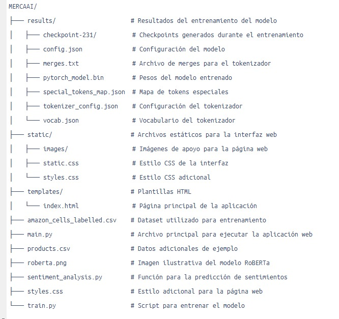

# Analizador de Sentimiento con RoBERTa

Este proyecto implementa un analizador de sentimiento utilizando el modelo de transformer **RoBERTa**, una versión más robusta de **BERT**. Permite determinar la polaridad del sentimiento (positivo, negativo o neutral) en textos mediante procesamiento de lenguaje natural.

---

## Descripción

Este proyecto incluye:

- Entrenamiento de un modelo basado en **RoBERTa** utilizando un dataset de productos de Amazon etiquetado para análisis de sentimiento.
- Un servidor web desarrollado con **Flask** para interactuar con el modelo.
- Predicción de sentimientos usando el modelo entrenado.
- Una interfaz web para ingresar texto y obtener resultados de análisis.
> **Nota:** La carpeta `results` se enviará comprimida en formato `.rar`. Es necesario descomprimirla antes de ejecutar el proyecto. Asegúrate de que los archivos contenidos en `results` estén en la ubicación correcta tras la extracción.

---

## Estructura del Proyecto

La estructura del proyecto es la siguiente:



## Instalación y Requisitos

### Prerrequisitos

- **Python 3.8 o superior**.
- Se recomienda crear un entorno virtual en **Anaconda** para evitar conflictos de dependencias.
  - Puedes crear un entorno con el siguiente comando:

    ```bash
    conda create -n mercaai_env python=3.8
    conda activate mercaai_env
    ```

- Luego, instala las siguientes librerías dentro del entorno:

    ```bash
    pip install flask
    pip install torch
    pip install transformers
    ```

---

## Instrucciones de Uso

### 1. Entrenamiento del Modelo

1. Asegúrate de que el archivo `amazon_cells_labelled.csv` esté en la raíz del proyecto.
2. Ejecuta el siguiente comando para entrenar el modelo:

    ```bash
    python train.py
    ```

   Esto generará los resultados en la carpeta `results/`.

### 2. Ejecutar la Aplicación Web

1. Asegúrate de estar dentro del entorno virtual (si usaste Anaconda).
2. Inicia el servidor Flask ejecutando el archivo `main.py`:

    ```bash
    python ./main.py
    ```

3. Abre tu navegador web y accede a la URL [http://127.0.0.1:5000](http://127.0.0.1:5000).

4. Introduce texto en el campo de la página web y obtén el análisis de sentimiento.

---

## Ejemplo de Uso

Prueba el analizador con frases como:

- "This product is excelent i like a lot."
- "I dont like this product at all."

El modelo clasificará las frases según su polaridad como **positiva**, **negativa** o **neutral**.

---

## Créditos

Este proyecto utiliza:

- La librería **Transformers** de Hugging Face para implementar el modelo RoBERTa.
- **Flask** para desarrollar la interfaz web.


